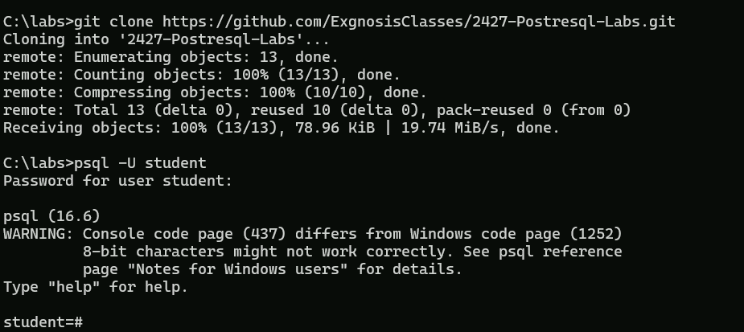
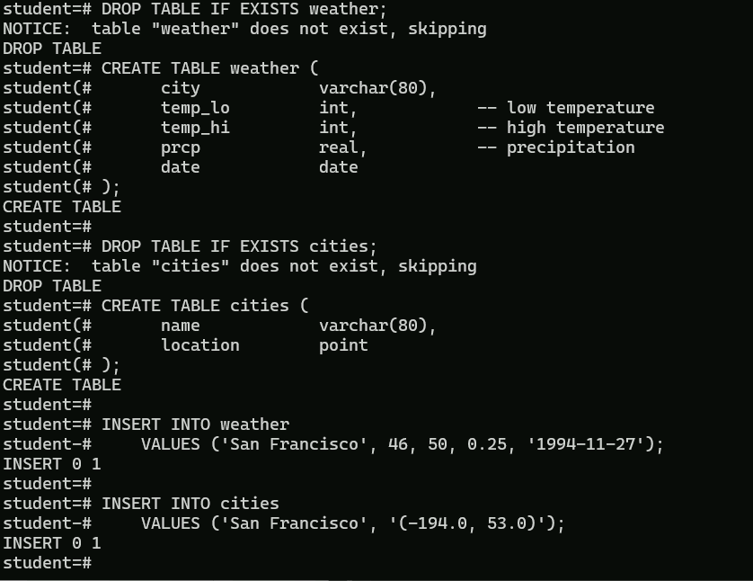

# Lab 2-1: Using psql 

### Objectives

1. Explore the command line options

### Part 1: Create the data

Log into your `student` postgres account on your Windows VM. 

Open the file `lab2-1.sql` from the repository in your VM using a text editor.

Copy and paste the contents into the `psql` shell.

You should see something like this:



stuff removed



To confirm that the table has been created properly and the data is in the table, execute the `\dt` command to display the tables in the database and use the following command to ensure the data is in the table

```shell
SELECT * from cities;
```
Once this is done, use the `\q` command to log out.


  
---

## Part 2: Command line options

Experiment with the command line options by running the following command. Note that the file `myfile.txt` is in the lab folder in the repository. Make sure the file is copied to the directory you are running `psql` from.

```shell
psql -U student -l

psql -U student -c "SELECT * FROM cities;"

psql -U student -t -c "SELECT * FROM cities;"

psql -U student -f myfile.txt

psql -U student -f myfile.txt --echo-queries

psql -U student -t -f myfile.txt --echo-queries

psql -U student -t -A -f myfile.txt --echo-queries
```

## Part 3: Logging

Login in as `student` using

```shell
psql -U student -q -L mylogfile.txt
```
Notice the suppression of the welcome message. Now execute a command, in this case

```shell
SELECT * FROM cities;
```
Then log out with `\q`

It should look something like this


Now check the directory you started `psql` from and look for `mylogfile.txt`

It should contain something like this

```text
********* QUERY **********
SELECT * FROM cities;
**************************

     name      | location  
---------------+-----------
 San Francisco | (-194,53)
(1 row)

```
---

## End Lab
